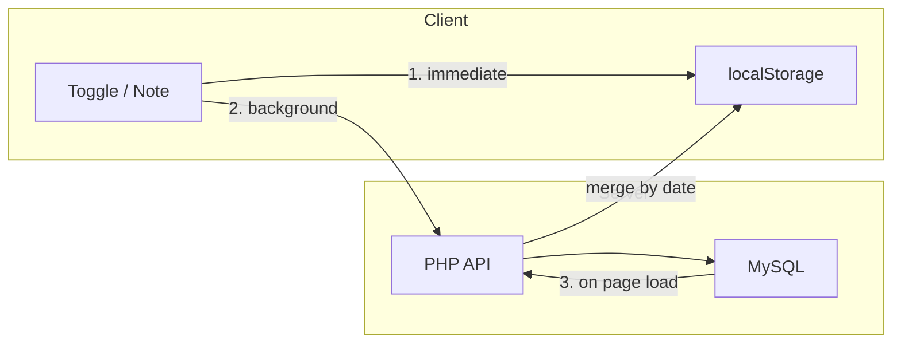

# Optional Account Sync for Cross-Device Usage

## Design Principles

- **Local-first**: Every write goes to localStorage immediately (instant UI, offline works). Server sync is a background secondary write.
- **Opt-in**: No account required. The app works exactly as today without one. A small "Sign in" link in the header or footer provides access.
- **Server is source of truth when logged in**: On page load, pull server data and merge with localStorage per-date using timestamps, so edits on phone and laptop don't overwrite each other.

## Data Flow



## Authentication

- Simple username + password via PHP's `password_hash()` / `password_verify()`
- Token-based (not session cookies) for Capacitor compatibility: on login, generate a random token, store it in a `tokens` table, return it to the client, client stores in localStorage and sends as `Authorization: Bearer <token>` header on API calls
- Token approach also avoids CORS cookie complications

## Database Schema

Three tables:

- **users**: `id`, `username`, `password_hash`, `created_at`
- **user_data**: `user_id`, `date_str`, `items_json`, `note`, `updated_at` (bigint JS timestamp), `PRIMARY KEY (user_id, date_str)`
- **tokens**: `token` (primary key), `user_id`, `created_at`

Per-date rows rather than a single JSON blob, so that edits to Monday on your phone don't conflict with edits to Tuesday on your laptop. Conflict resolution is last-write-wins per date, using the `updated_at` timestamp.

## API Endpoints (PHP)

All under `api/` subdirectory of the app:

- **POST `api/register.php`** — Create account (username, password). On success, also accepts optional `checklist` and `notes` JSON to migrate existing localStorage data into the new account.
- **POST `api/login.php`** — Authenticate, return token.
- **GET `api/data.php`** — Fetch all user data (all dates). Requires token.
- **POST `api/data.php`** — Save data for one date (`date_str`, `items_json`, `note`, `updated_at`). Requires token. Uses `INSERT ... ON DUPLICATE KEY UPDATE`.
- **POST `api/logout.php`** — Delete token.

## Frontend Changes

- **Storage abstraction in `app.js`**: Replace direct `loadData()`/`saveData()`/`getNote()`/`saveNote()` with a storage layer that writes to localStorage always, and if a token is present, also pushes to the server in the background (fire-and-forget `fetch()` call, no `await` blocking the UI).
- **Sync on load**: If token exists, `GET api/data.php`, merge with localStorage per-date using `updated_at` timestamps (newer wins), save merged result back to both localStorage and server.
- **Account migration**: When user creates an account, upload their existing localStorage data so nothing is lost.
- **UI**: A small "Sign in" link (bottom of the page or in the header). Tapping it shows a simple inline form for login/register. When signed in, show username and "Sign out" link instead.

## Capacitor Considerations

- Token-based auth works natively in Capacitor WebViews (no cookie/CORS issues)
- API calls need **absolute URLs** (e.g., `https://exodus40lite.stephens.page/api/data.php`) rather than relative paths, since Capacitor serves files from a local origin
- The PHP API should set `Access-Control-Allow-Origin` headers to support requests from Capacitor's origin (`capacitor://localhost` on iOS, `http://localhost` on Android)
- No other Capacitor-specific changes needed; the rest of the app (localStorage, service worker, rendering) works as-is in a WebView

## File Structure

```
api/
  config.php          -- DB connection + token validation helper
  register.php        -- POST: create account, optional data migration
  login.php           -- POST: authenticate, return token
  data.php            -- GET: fetch all, POST: save one date
  logout.php          -- POST: delete token
  setup.sql           -- Schema creation script
app.js                -- Modified: storage abstraction + sync + account UI
style.css             -- Modified: login/account form styles
index.html            -- Modified: account UI container element
```

## What This Does NOT Include

- No "forgot password" flow (small trusted group, can reset manually in DB)
- No email verification
- No admin dashboard
- No real-time sync (polling or websocket) — data syncs on page load and on each write, which is sufficient for one user on two devices
