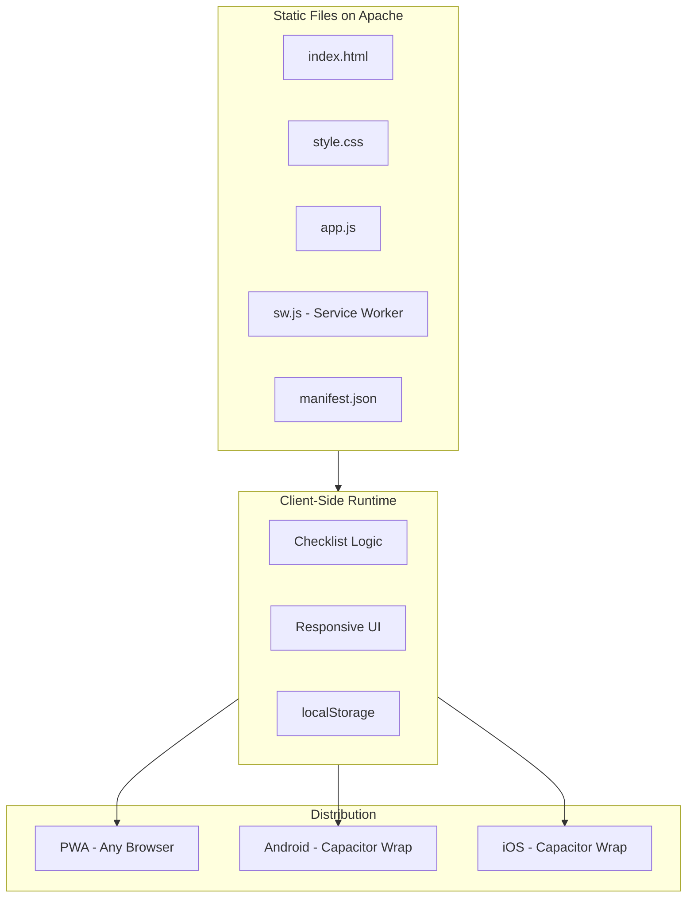

# Exodus 40 Lite -- Implementation Plan

Build a zero-dependency PWA checklist tracker for the Good Wine Group's Lent 2026 rule of life. Vanilla HTML/CSS/JS served as static files, with Capacitor available for future Android/iOS wrapping.

## Stack

- Vanilla HTML / CSS / JS (no frameworks, no build step)
- Hand-written Service Worker (offline caching)
- localStorage (data persistence)
- manifest.json (PWA installability)
- Apache on Linux (hosting)
- Capacitor (future Android/iOS wrap)

## Architecture



## File Structure

```
exodus40lite/
  index.html        -- Main app page
  style.css         -- Styles (mobile-first)
  app.js            -- Checklist logic and DOM manipulation
  sw.js             -- Service worker for offline caching
  manifest.json     -- PWA manifest (name, icons, theme)
  icons/            -- App icons (192x192, 512x512)
  specs.md          -- Specifications (source of truth)
  plan.md           -- This file
```

## Implementation Steps

- [x] Define specs and stack decisions in specs.md
- [x] Create index.html with the checklist UI (all 6 categories, daily/weekly items)
- [x] Create style.css (mobile-first, touch-friendly, purple/gold Lenten theme)
- [x] Create app.js (check/uncheck items, persist to localStorage, date-aware daily/weekly tracking)
- [x] Create sw.js (cache-first service worker for offline use)
- [x] Create manifest.json and PNG/SVG icons for PWA installability
- [x] Test in browser (checkbox persistence, date navigation, fasting logic, progress bar)
- [ ] (Future) Wrap with Capacitor for Android/iOS
